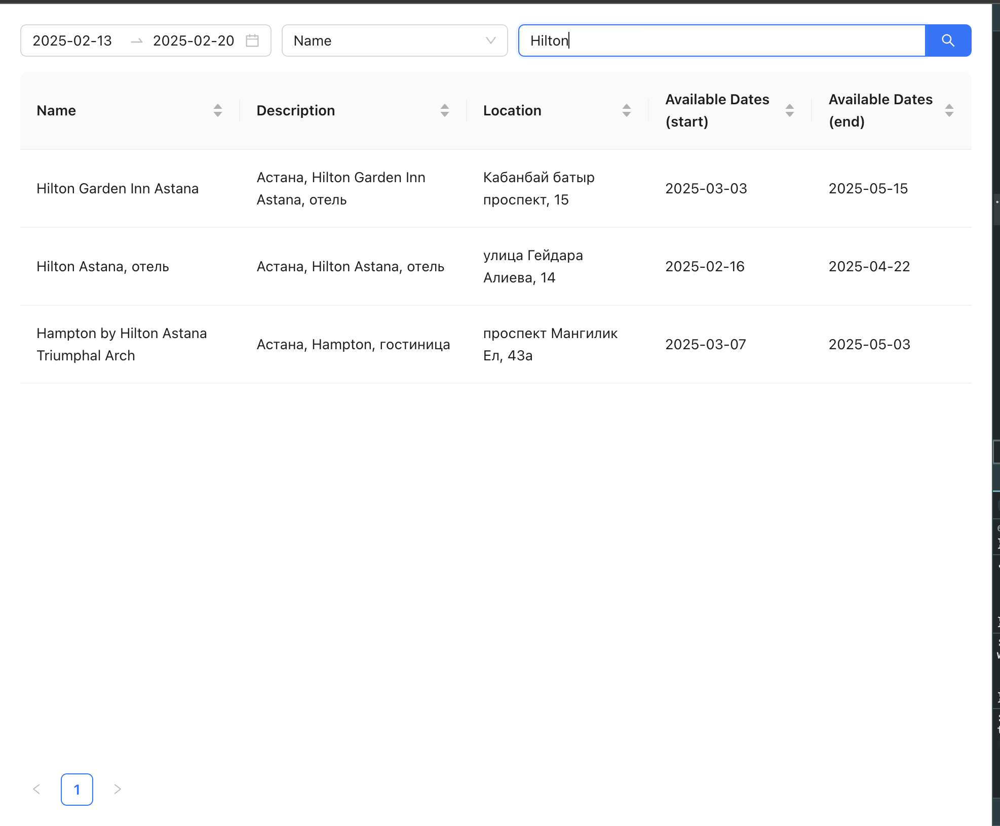

## 🚀 Quick Start

### Prerequisites

- Install [Node.js](https://nodejs.org)
- Terminal `bash/powershell` to install dependencies and run

## 📸 Screenshot



## 📦 Run Server side

1. **Go to server folder from root**

```shell
cd server
```

2. **Load npm dependencies**

```shell
npm install
```

3. **Create `.env` file and set variable/2gis api key**

```
TWOGIS_API_KEY=
```

4. **Start server**

```shell
npm run start:dev
```

## 📦 Run Client side

1. **Go to client folder from root**

```shell
cd client
```

2. **Load npm dependencies**

```shell
npm install
```

3. **Start client**

```shell
npm run start
```

## 🎮 Usage

1. **Open & Try it**

- Open [localhost](http://localhost:3001/) if not opened when `npm run start` script runned on client side.

### Powered

- [Create React App](https://create-react-app.dev/)
- [Nest](https://docs.nestjs.com/)
- [ChatGPT help](https://chatgpt.com/share/67ae4f19-0270-800d-8f30-22ac6f30a3b0)
